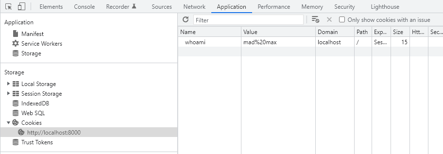
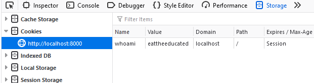
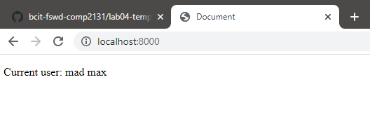

## Our goal

Okay, we want to make a web-app that lets users log in.

You should try out this web-app as it exists.   There's just three routes:

* a home page
* a login page
* the route to process login attempts

There's already a database of users with passwords, so we won't do user signup today.

Try out the app.  Do the usual `npm install` thing, then `npm dev`, then open it in your browser.

Go to the login page, and log in, using one of the users from the "database" (go look at the fake database file for usernames/passwords).  The username and password you use in this form should show up in the server console, showing that you got the data to the backend.

What we WANT is for logins to be reflected on the homepage.  That is, if you log in, it knows you logged in, and it greets you by name every time you load that page.  Including if you close the web-app and re-open it.

Ideally we'd also be able to log out.  Luxury.

## Step 1 - Our first cookie

The ability to set a cookie is built into Express.  The documentation in question is at https://expressjs.com/en/4x/api.html#res.cookie

Let's change our `POST /login` route so that, whatever username the user sent us from the form, we put that into the cookie.  Now, cookies are key-value pairs, so we need a key (aka a cookie *name*) for this cookie.  Let's be a little bit weird and use `whoami` as the name.  Normally I'd probably use "username", because that's what it is, but I just want you to notice that you have flexibility.

So,
 * read the username out of the body that was sent from the form
 * write that username into a cookie, with `whoami` as the cookie name
 * load the website, go to the login page, and log in as someone

So hopefully the cookie is set.  We can find out by opening our browser dev tools.  In Chrome the tab is called Application for some reason, and then on the left side you look for Storage -> Cookies.  In Firefox the tab is just called Storage, and then on the left side you look for Cookies.  You should see something like this:

</img>
</img>

## Step 2 - Reading our cookie back

Okay, this always seems weird to me, but to read cookies in Express we need an additional library.  But the library is made by the team that makes Express, but we still have to install it separately.  I don't know why.

https://expressjs.com/en/resources/middleware/cookie-parser.html

You need to figure out how to:

* install the library
* require the library in your app.js file
* activate it with `app.use`
* read the cookie inside the `GET /` route
* pass that cookie value to the EJS file in a useful way

When all that's done, you should be able to do this:

</img>

Congrats, we have cookies doing something!   Try closing the browser and re-opening it!  Are we still logged in?

## Problem 1 - check the password

I don't know how you solved the previous section, so maybe you didn't make this mistake, but I did: I didn't check the password.  That's why I can log in as "mad max", even though there's no such user!  (Weird, right?)

So, yeah, if you're already verifying the user and verifying the password, you can move along.

But if you're like me and you missed the verification, fix the code so that you check the password.  If the password is wrong, make sure that the user is not set.  (If you didn't change the EJS file, you'll be able to tell that there's no user because the homepage will say "Current user: ???")

## Problem 2 - no logout

We can't log out.  I mean, we're devs, we can log out by opening our dev tools and deleting the cookie.  Actually, make sure you try that at least once.

(I mean it.  Try logging out by deleting the cookie.)

But, okay, now that you've done that, make logging out possible for normal users.

* add a form to the index page, with a submit button that says "Logout", and it goes to `POST /logout`
* create a new `POST /logout` route
* in this route, clear the cookie (read the docs https://expressjs.com/en/4x/api.html#res.clearCookie )
* just like `POST /login`, finish up with a redirect to `GET /`

## Problem 3 - hackers can change their username

Hopefully you now have password security.  But a moderately competent hacker can just open up their dev tools, and change their cookies!  Try it.  Log in as `a_dawg` as normal, but then in your dev tools, change the `whoami` cookie to say `the_zuck`.  Refresh the page.  Wow, much hack, very leet.

So this is pretty crappy.  There are many ways to solve this problem.

* we could encrypt and/or sign the data we send, so that although the hacker can change it, they can only change it to garbage (unless they break the encryption)
* we could send only a "session token", which will be a key into some kind of global state on the server, possibly stored in a database.  of course they could edit the key, but if we make the key be really a lot of digits, they probably won't be able to guess a different valid key
* etc

Personally, philosophically, I like the "session token" approach, but it's harder to explain and even once it's explained it is more work.  So let's just do the other one.

We could do it all by hand, but that would suck.  So your job is to figure out how to use https://expressjs.com/en/resources/middleware/cookie-session.html .  This is another library by the Express team, by the way.  And at the top it talks about some of the pros and cons of the approaches I mentioned above.

To get this working, I think you'll need to:

* install it, require it, and `app.use` it
* change the place that you *write* the cookie to use `req.session.whoami`, and to use it as an object property, not as a method
* change the place that you *read* the cookie also to use `req.session.whoami`
* go read the cookies in the dev tools.  I bet you can't hack them now

## Stretch 1 - cram other data into the cookie

This is pretty open-ended, but think of some other silly thing that you can store in a cookie, and do that.

## Stretch 2 - password hashing

Passwords really shouldn't be stored in databases in plain text, there's no reason for it.  Now, this is is a fake joke database, but we could still use the `bcrypt` library to hash passwords.  Can you figure that out?

## Stretch 3 - session token instead of encrypted cookie

I mentioned above that you can store our state on the server, sending only a "session token" to the client.  Most libraries to do this have a bunch of stuff to interface with a database, blah blah, that's nice.  Can you hack something together using only our existing `fake-db.js` (though you'd probably add some functions and a new const object), and some unecrypted cookies?   I recommend using `Math.random().toString().slice(2)` for your session keys, though not that that is not cryptographically secure randomness, so blah blah this is just an experiment.

